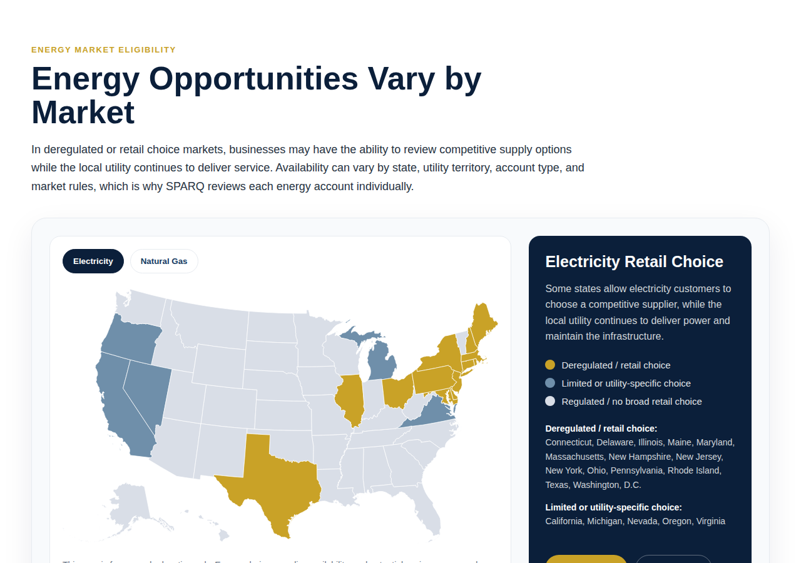
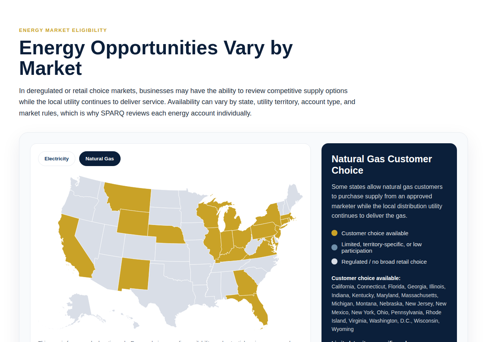

# SPARQ Energy Market Map

An interactive US map that shows where businesses may have **energy choice** —
i.e. where a customer can shop for a competitive electricity or natural‑gas
supplier while the local utility keeps delivering the service. Built for the
SPARQ *Energy Optimization* offering.

Visitors toggle between two markets (**Electricity retail choice** and
**Natural Gas customer choice**). Each state is shaded by how open its retail
market is, and a side panel + hover tooltips update to match.




---

## What it does (reverse‑engineered)

The original was a single self‑contained `<section>` blob. Here's what it
actually does, unpacked:

| Piece | Purpose |
|-------|---------|
| **jsVectorMap** (`window.jsVectorMap`) | Lightweight SVG map library that draws the states and handles hover/tooltips. |
| **`us_aea` map** | The US‑states geometry (Albers Equal‑Area, with Alaska & Hawaii as insets), keyed by `US-AL`, `US-CA`, … |
| **`marketData`** | Per‑market copy + the lists of states that are `full` (choice), `limited`, or (by omission) `regulated`. This is the real content. |
| **Colour scale** | `full` → gold `#c9a227`, `limited` → slate `#6f8faa`, `regulated` → grey `#d9dee7`. |
| **Toggle buttons** | Swap the region colours, side‑panel title/description/legend, and the categorised state list. |
| **Tooltips** | On hover, show `"<State>: <status text>"` for the current market. |
| **CTAs** | "Start Review" → `/start-review/`, "Contact Us" → `/contact/`. |

Everything is namespaced under `#sparq-energy-market-map`, so it won't collide
with theme styles.

> ⚠️ **Data disclaimer (kept from the original):** the state lists are a
> starting point for public education. Deregulation status changes and varies by
> utility territory, customer class, and program. **Confirm with the SPARQ
> energy provider before presenting this as service coverage.** Edit the lists
> in `assets/js/sparq-energy-market-map.js` (`marketData.electricity` /
> `marketData.gas`, the `full` and `limited` arrays).

---

## Two bugs found & fixed while reverse‑engineering

1. **The map never loaded.** The original pulled the US map from
   `cdn.jsdelivr.net/npm/jsvectormap@1.6.0/dist/maps/us-aea.js`. That file is
   **not published in the npm package** (only `world` / `world-merc` are), so
   that URL 404s and `new jsVectorMap({ map: "us_aea" })` throws — no map
   renders. Fixed by **generating our own `us_aea` map** from authoritative,
   public‑domain US geometry (`us-atlas`, Natural Earth) and **self‑hosting** it.
   No third‑party CDN is required anywhere.

2. **Every state rendered black.** The series was configured as
   `scale: {}` with `values` set to raw colour strings. jsVectorMap runs each
   value through the scale (`scale.getValue(value)` → `{}[color]` → `undefined`),
   so the fill became `"undefined"` and the states painted black. Fixed by using
   the API as intended: `values` maps each state → a **status category**
   (`full` / `limited` / `regulated`) and `scale` maps **category → colour**.

Both are verified fixed — see *Verifying* below.

---

## Repository layout

```
sparq-energy-market-map/
├── index.html                     # Standalone demo — open directly in a browser
├── preview-electricity.png        # Screenshots used in this README
├── preview-gas.png
├── assets/
│   ├── css/sparq-energy-market-map.css
│   ├── js/sparq-energy-market-map.js      # the component logic + market data
│   └── vendor/jsvectormap/                # bundled library + generated US map (no CDN)
│       ├── jsvectormap.min.js
│       ├── jsvectormap.min.css
│       ├── us-aea.js                       # generated "us_aea" map
│       └── LICENSE
├── wordpress/
│   └── inline-block.html          # self-contained paste-in block (Custom HTML)
├── wordpress-plugin/
│   ├── sparq-energy-market-map/   # the installable plugin
│   │   ├── sparq-energy-market-map.php
│   │   ├── templates/section.php
│   │   └── assets/…               # synced copy of ../assets
│   └── sparq-energy-market-map.zip# ready to upload in wp-admin
└── tools/generate-us-map/         # regenerate us-aea.js from source geometry
    ├── generate-us-aea.mjs
    └── package.json
```

---

## How to use it

### 1. Preview locally
Open `index.html` in any browser. It loads the bundled assets — no build step,
no internet needed.

### 2. Inline (WordPress Custom HTML block, or any CMS)
Copy the entire contents of **`wordpress/inline-block.html`** into a **Custom
HTML** block (or any raw‑HTML/Code area). It's fully self‑contained: styles, the
map library, the map data, and the behaviour are all inlined — **zero external
requests**.

> WordPress only keeps `<script>`/`<style>` inside a Custom HTML block for users
> with the `unfiltered_html` capability (admins on a single site). If your role
> can't save raw scripts (common on multisite), use the plugin instead.

### 3. WordPress plugin (recommended for clean, reusable install)
1. In **wp‑admin → Plugins → Add New → Upload Plugin**, upload
   `wordpress-plugin/sparq-energy-market-map.zip`, then **Activate**.
2. Add the shortcode to any page/post:
   ```
   [sparq_energy_market_map]
   ```
3. Optional — override the button links:
   ```
   [sparq_energy_market_map review_url="/energy-review/" contact_url="/contact/"]
   ```

The plugin registers the assets and only enqueues them on pages that actually
use the shortcode. Because the library and US map are bundled, it works even if
outbound CDNs are blocked.

---

## Editing the content

- **Which states are open / limited:** `assets/js/sparq-energy-market-map.js`
  → `marketData.electricity` and `marketData.gas` (`full` / `limited` arrays).
- **Copy (titles, descriptions, legend labels):** same `marketData` object.
- **Colours:** the `colors` / `scale` objects at the top of the same file, and
  the `--sparq-*` CSS variables in `assets/css/sparq-energy-market-map.css`.
- **Button links:** edit the markup (`index.html` / `templates/section.php`) or
  pass shortcode attributes (plugin).

After editing the standalone `assets/`, re‑sync the plugin copy:
```bash
cp -R assets/css assets/js assets/vendor \
   wordpress-plugin/sparq-energy-market-map/assets/
```
Then rezip if you distribute the plugin:
```bash
cd wordpress-plugin && zip -r sparq-energy-market-map.zip sparq-energy-market-map
```

---

## Regenerating the US map

The `us_aea` map is generated (not hand‑authored) so it can be reproduced and
tweaked. It comes from `us-atlas` (Natural Earth, public domain) projected with
`d3-geo`, output in jsVectorMap's map format (registered as `us_aea`).

```bash
cd tools/generate-us-map
npm install
npm run build      # writes ../../assets/vendor/jsvectormap/us-aea.js
```

Output: 50 states + DC, ~127 KB, coordinate space 900×527.

---

## Credits & licences

- **jsVectorMap** — MIT (bundled `LICENSE` in `assets/vendor/jsvectormap/`).
- **us-atlas / Natural Earth** — public domain geometry.
- This component's own code — MIT.
